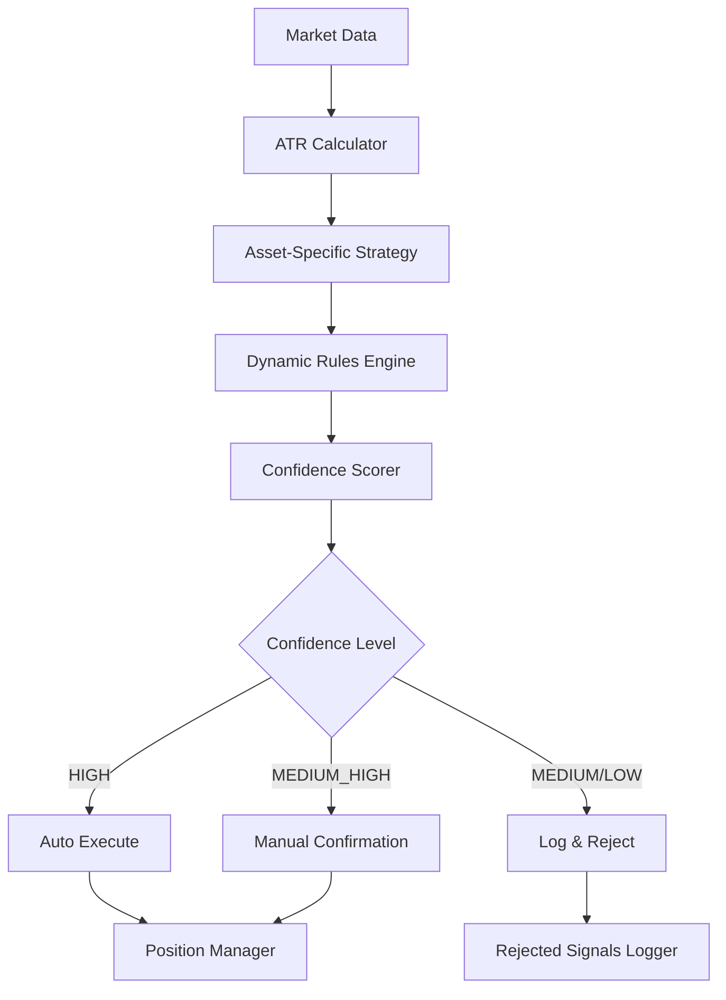

# Design Document: Dynamic ATR-Based Trading Rules

## Overview

This design transforms the existing semi-automatic trading bot from fixed pip-based calculations to dynamic ATR-based rules while maintaining the confidence-based execution model. The system will auto-execute HIGH confidence signals, display MEDIUM_HIGH signals for manual confirmation, and log all rejected signals for analysis.

The design focuses on three core assets (EURUSD, XAUUSD, BTCEUR) with asset-specific strategies that adapt to real market volatility using ATR calculations instead of fixed values.

## Architecture

### Current System Analysis

The existing bot architecture consists of:
- **Signal Detection**: `signals.py` with strategy-specific functions
- **Configuration Management**: `rules_config.json` with per-asset parameters
- **Confidence System**: Existing 5-level confidence scoring (HIGH/MEDIUM_HIGH/MEDIUM/LOW_MEDIUM/LOW)
- **Execution Logic**: `bot.py` with auto-execution capabilities
- **Rejected Signal Tracking**: `rejected_signals_tracker.py` for comprehensive logging

### Enhanced Architecture



## Components and Interfaces

### 1. ATR Calculator Component

**Purpose**: Calculate dynamic ATR values for volatility-adaptive rules

**Interface**:
```python
class ATRCalculator:
    def calculate_atr(self, df: pd.DataFrame, period: int = 14) -> float
    def get_atr_relative_value(self, value: float, atr: float) -> float
    def normalize_by_atr(self, distance: float, atr: float, price: float) -> float
```

**Implementation**: Extends existing indicator calculations in `signals.py`

### 2. Enhanced Strategy Components

#### EURUSD Breakout Strategy
**Current**: Fixed pip breakout detection
**Enhanced**: ATR-relative breakout strength calculation

```python
def calculate_breakout_strength(breakout_size: float, atr: float) -> str:
    ratio = breakout_size / atr
    if ratio > 0.6: return 'strong'
    elif ratio > 0.4: return 'medium'
    elif ratio > 0.25: return 'weak'
    return 'invalid'
```

#### XAUUSD Reversal Strategy
**Current**: Fixed distance to psychological levels
**Enhanced**: Dynamic level generation with session filtering

```python
def generate_dynamic_levels(price: float) -> float:
    return round(price / 50) * 50

def is_london_ny_session(timestamp: datetime) -> bool:
    hour = timestamp.hour
    return 8 <= hour <= 22  # London (8-17) + NY (13-22) overlap
```

#### BTCEUR Momentum Strategy
**Current**: Basic EMA crossover
**Enhanced**: EMA slope analysis with ATR-relative measurements

```python
def calculate_ema_slope(ema_values: pd.Series, periods: int = 3) -> float:
    return ema_values.iloc[-1] - ema_values.iloc[-1-periods]
```

### 3. Streamlined Confidence System

**Current**: Complex multi-factor scoring
**Enhanced**: Focused 4-factor evaluation

```python
class ConfidenceScorer:
    def calculate_confidence(self, signal_data: dict) -> str:
        # Limit to exactly 4 factors:
        structural_score = self._evaluate_structural_factors(signal_data)  # 2 factors
        quality_score = self._evaluate_quality_factor(signal_data)         # 1 factor  
        context_score = self._evaluate_context_factor(signal_data)         # 1 factor
        
        total_score = structural_score + quality_score + context_score
        return self._score_to_confidence_level(total_score)
```

### 4. Execution Logic Component

**Interface**:
```python
class ExecutionManager:
    def should_auto_execute(self, confidence: str) -> bool
    def should_show_manual(self, confidence: str) -> bool
    def should_log_only(self, confidence: str) -> bool
```

**Logic**:
- HIGH → Auto-execute immediately
- MEDIUM_HIGH → Show with manual confirmation buttons
- MEDIUM/LOW_MEDIUM/LOW → Log only, no display

### 5. Enhanced Rejected Signals Logger

**Current**: Basic rejection tracking
**Enhanced**: Comprehensive signal analysis logging

```python
class EnhancedRejectedSignalsLogger:
    def log_rejected_signal(self, signal_data: dict, rejection_details: dict):
        # Log format:
        {
            "timestamp": "2024-01-27T10:30:00Z",
            "symbol": "EURUSD", 
            "signal_type": "BUY",
            "confidence": "MEDIUM",
            "score": 2.3,
            "rejection_reasons": ["weak_breakout", "low_atr_separation"],
            "market_conditions": {
                "atr": 0.0012,
                "breakout_strength": 0.35,
                "ema_separation_atr": 0.25
            }
        }
```

## Data Models

### Signal Data Model
```python
@dataclass
class EnhancedSignal:
    symbol: str
    type: str  # BUY/SELL
    entry: float
    sl: float
    tp: float
    confidence: str  # HIGH/MEDIUM_HIGH/MEDIUM/LOW_MEDIUM/LOW
    strategy: str
    atr_value: float
    atr_multipliers: dict  # {sl: 1.5, tp: 3.0}
    breakout_strength: Optional[float] = None
    ema_separation_atr: Optional[float] = None
    rsi_score: Optional[float] = None
    session_valid: bool = True
    expires: datetime = None
```

### Configuration Data Model
```python
@dataclass 
class AssetConfig:
    symbol: str
    strategy: str
    sl_atr_multiplier: float
    tp_atr_multiplier: float
    max_daily_trades: int
    min_rr_ratio: float
    expires_minutes: int
    session_hours: Optional[str] = None
    special_params: dict = field(default_factory=dict)
```

## Correctness Properties

*A property is a characteristic or behavior that should hold true across all valid executions of a system-essentially, a formal statement about what the system should do. Properties serve as the bridge between human-readable specifications and machine-verifiable correctness guarantees.*

<function_calls>
<invoke name="prework">
<parameter name="featureName">dynamic-atr-trading-rules

### Property Reflection

After analyzing all acceptance criteria, I identified several areas where properties can be consolidated:

**Redundancy Analysis:**
- Properties 1.3, 1.5 (ATR-based SL calculation) and 1.4, 1.6 (SL-based TP calculation) can be combined into comprehensive ATR-based risk management properties
- Properties 2.4 and 2.5 (replacing fixed values with ATR) can be consolidated into a single "no fixed pip values" property
- Properties 3.4 and 3.5 (XAUUSD fixed dollar amounts) are complementary and should remain separate
- Properties 6.1, 6.2, 6.3 (execution logic by confidence) can be combined into a single comprehensive execution property

**Final Property Set:**

### Property 1: ATR-Based Risk Management
*For any* valid trading signal, the stop loss and take profit calculations should use ATR-relative measurements where EURUSD uses ATR×1.5 for SL and SL×2.0 for TP, BTCEUR uses ATR×2.5 for both SL and TP multipliers
**Validates: Requirements 1.3, 1.4, 1.5, 1.6**

### Property 2: ATR-Relative Strength Classification  
*For any* breakout or separation measurement, the classification should be based on ATR-relative ratios rather than fixed pip values, where breakout_size/ATR > 0.6 indicates strong, > 0.4 indicates medium, and > 0.25 indicates weak
**Validates: Requirements 1.1, 1.2, 2.4, 2.5, 4.4**

### Property 3: RSI Scoring Optimization
*For any* EURUSD signal, RSI values between 55-70 should be scored as optimal for buy signals and RSI values between 30-45 should be scored as optimal for sell signals
**Validates: Requirements 2.1, 2.2**

### Property 4: XAUUSD Fixed Dollar Management
*For any* XAUUSD signal, the stop loss should be exactly 12$ and take profit should be exactly 24$, regardless of ATR or other volatility measures
**Validates: Requirements 3.4, 3.5**

### Property 5: Dynamic Level Generation
*For any* XAUUSD price, the generated support/resistance level should equal round(price / 50) * 50, and distance classification should use ≤5$ as strong, ≤8$ as medium, and ≤10$ as weak
**Validates: Requirements 3.1, 3.2**

### Property 6: Session Filtering
*For any* XAUUSD signal, it should only be processed during London (8-17 GMT) and New York (13-22 GMT) trading sessions
**Validates: Requirements 3.3**

### Property 7: BTCEUR Momentum Analysis
*For any* BTCEUR signal analysis, the EMA50 slope should be calculated as EMA50[current] - EMA50[current-3], and positive slope should favor buy signals while negative slope should favor sell signals
**Validates: Requirements 4.1, 4.2, 4.3**

### Property 8: Trade Limit Enforcement
*For any* asset, the maximum concurrent trades should be enforced where EURUSD allows 4, XAUUSD allows 3, and BTCEUR allows 4 concurrent positions
**Validates: Requirements 2.3, 3.6, 4.6**

### Property 9: Streamlined Confidence Calculation
*For any* signal evaluation, the confidence score should be calculated using exactly 2 structural factors, 1 quality factor, and 1 context factor, without requiring perfect scores across all factors
**Validates: Requirements 5.1, 5.2, 5.5**

### Property 10: Confidence-Based Execution Logic
*For any* processed signal, HIGH confidence signals should auto-execute, MEDIUM_HIGH signals should display with manual confirmation, and MEDIUM/LOW_MEDIUM/LOW signals should be logged only without display
**Validates: Requirements 6.1, 6.2, 6.3**

### Property 11: Comprehensive Signal Logging
*For any* signal regardless of confidence level, all signal details including timestamp, symbol, type, confidence, score, and rejection reasons should be logged to persistent storage
**Validates: Requirements 6.4, 7.1, 7.2, 7.3, 7.4, 7.5**

### Property 12: Configuration-Driven Parameters
*For any* configurable parameter (ATR multipliers, confidence weights, trade limits, session filters), changes to the configuration should be applied without requiring system restart
**Validates: Requirements 8.1, 8.2, 8.3, 8.4, 8.5**

### Property 13: Signal Expiration Management
*For any* BTCEUR signal, the expiration time should be set between 180-240 minutes from signal generation
**Validates: Requirements 4.5**

### Property 14: Wick Validation for Reversals
*For any* XAUUSD reversal signal, the candle wick should be at least 30% of the total candle range to be considered valid
**Validates: Requirements 3.7**

## Error Handling

### ATR Calculation Errors
- **Invalid/Missing Data**: Return default ATR value based on symbol (EURUSD: 0.0010, XAUUSD: 8.0, BTCEUR: 200.0)
- **Zero ATR**: Use minimum threshold values to prevent division by zero
- **Extreme ATR Values**: Cap ATR at reasonable maximum values per asset

### Configuration Errors
- **Missing Config**: Fall back to hardcoded defaults for each asset
- **Invalid Values**: Validate ranges and use defaults for out-of-range values
- **File Access Errors**: Log error and continue with cached configuration

### Signal Processing Errors
- **Market Data Unavailable**: Skip signal generation for that cycle
- **Calculation Failures**: Log detailed error and mark signal as invalid
- **MT5 Connection Issues**: Queue signals for retry when connection restored

### Logging Errors
- **Database Unavailable**: Fall back to file-based logging
- **Disk Space Issues**: Implement log rotation and cleanup
- **Serialization Errors**: Log raw data with error markers

## Testing Strategy

### Dual Testing Approach

The system will use both unit tests and property-based tests to ensure comprehensive coverage:

**Unit Tests**: Focus on specific examples, edge cases, and integration points
- Test specific ATR calculations with known values
- Test configuration loading and validation
- Test error handling scenarios
- Test integration between components

**Property-Based Tests**: Verify universal properties across all inputs
- Generate random market data and verify ATR calculations
- Test signal processing with various confidence combinations
- Verify logging captures all required fields
- Test configuration changes apply correctly

### Property-Based Testing Configuration

- **Framework**: Use `hypothesis` for Python property-based testing
- **Iterations**: Minimum 100 iterations per property test
- **Test Tags**: Each property test references its design document property
- **Tag Format**: **Feature: dynamic-atr-trading-rules, Property {number}: {property_text}**

### Testing Implementation Strategy

**ATR Calculation Testing**:
```python
@given(st.floats(min_value=0.0001, max_value=0.01))
def test_atr_breakout_classification(atr_value):
    """Feature: dynamic-atr-trading-rules, Property 2: ATR-Relative Strength Classification"""
    breakout_size = atr_value * 0.7  # Should be 'strong'
    result = calculate_breakout_strength(breakout_size, atr_value)
    assert result == 'strong'
```

**Confidence System Testing**:
```python
@given(st.dictionaries(
    keys=st.sampled_from(['structural', 'quality', 'context']),
    values=st.floats(min_value=0, max_value=1)
))
def test_confidence_calculation_factors(factor_scores):
    """Feature: dynamic-atr-trading-rules, Property 9: Streamlined Confidence Calculation"""
    confidence = calculate_confidence(factor_scores)
    assert confidence in ['HIGH', 'MEDIUM_HIGH', 'MEDIUM', 'LOW_MEDIUM', 'LOW']
```

**Execution Logic Testing**:
```python
@given(st.sampled_from(['HIGH', 'MEDIUM_HIGH', 'MEDIUM', 'LOW_MEDIUM', 'LOW']))
def test_execution_logic_by_confidence(confidence_level):
    """Feature: dynamic-atr-trading-rules, Property 10: Confidence-Based Execution Logic"""
    should_auto = should_auto_execute(confidence_level)
    should_manual = should_show_manual(confidence_level)
    should_log = should_log_only(confidence_level)
    
    if confidence_level == 'HIGH':
        assert should_auto and not should_manual and not should_log
    elif confidence_level == 'MEDIUM_HIGH':
        assert not should_auto and should_manual and not should_log
    else:
        assert not should_auto and not should_manual and should_log
```

### Unit Testing Balance

Unit tests complement property tests by focusing on:
- **Specific Examples**: Test known good/bad signal scenarios
- **Edge Cases**: Test boundary conditions (zero ATR, extreme prices)
- **Integration Points**: Test component interactions
- **Error Conditions**: Test failure modes and recovery

Property tests handle comprehensive input coverage through randomization, while unit tests ensure specific critical scenarios work correctly.